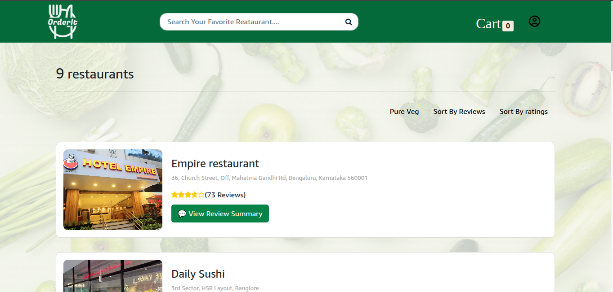
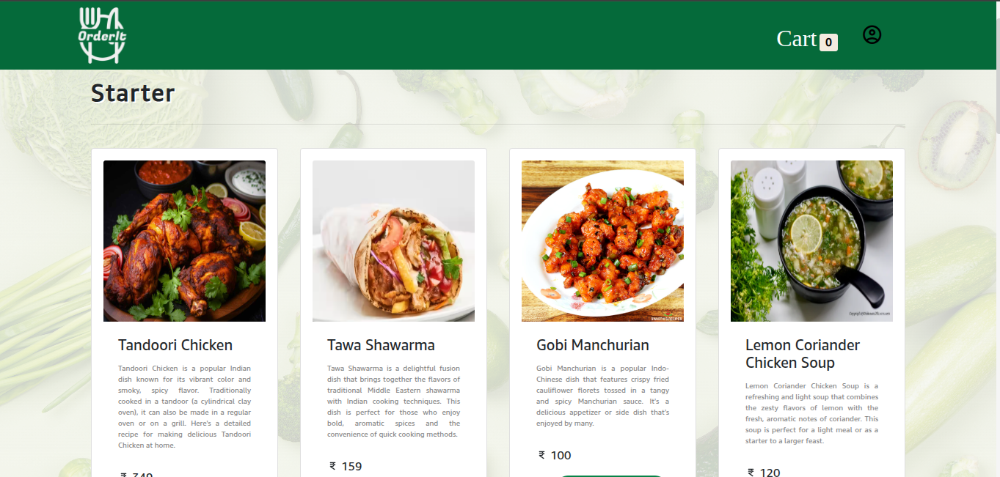
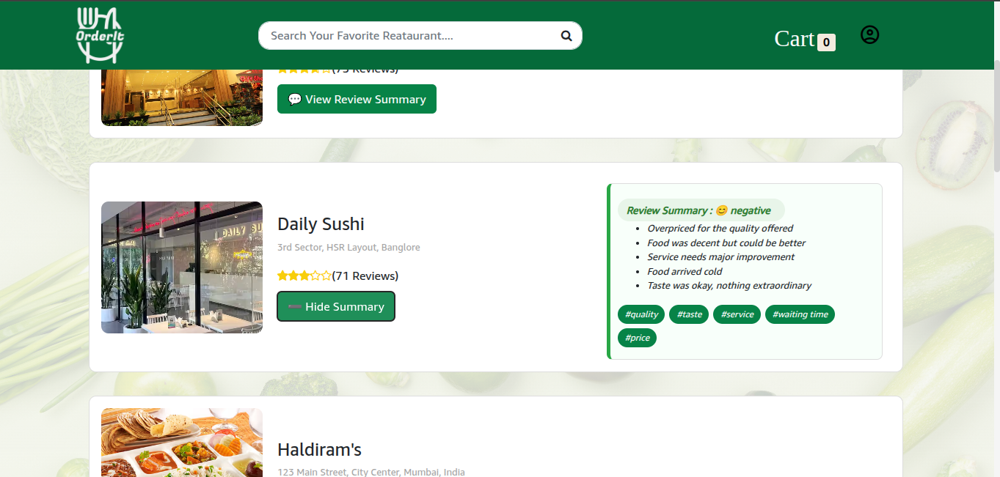
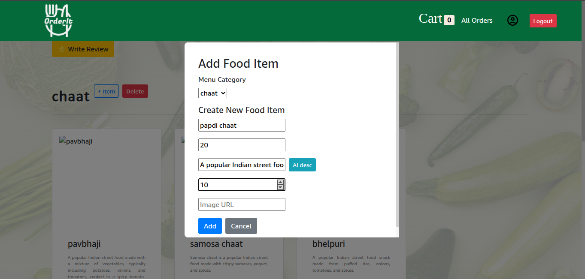
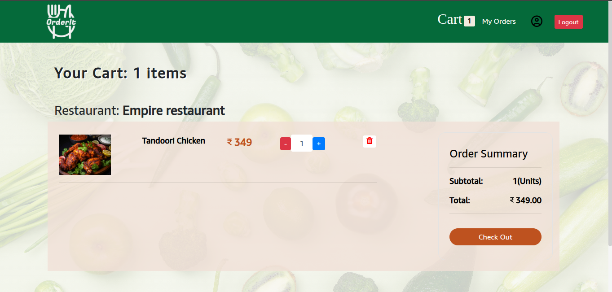
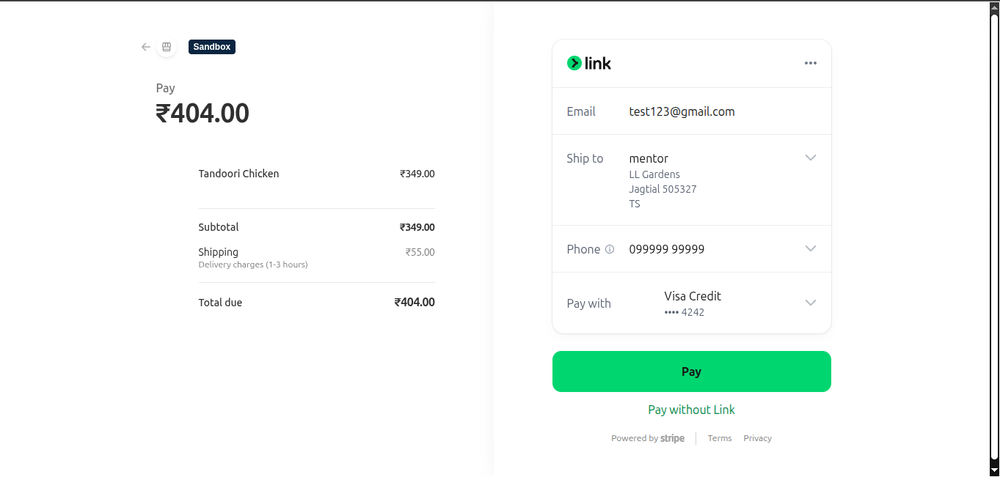
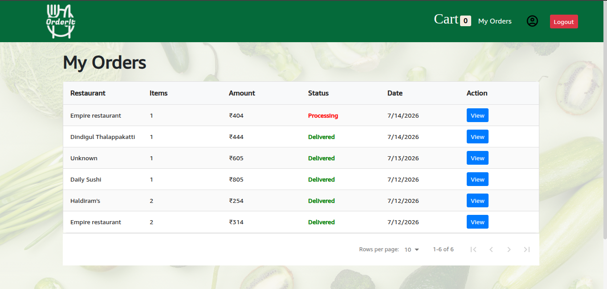

# 🍽️ FoodGenie - AI Powered Food Ordering Application

FoodGenie is a full-stack AI-powered food ordering web application that enables users to explore restaurants, browse menus, manage their cart, place food orders, make test payments, and submit restaurant reviews.

The platform also integrates Artificial Intelligence to generate structured food descriptions and summarize customer reviews, enhancing both restaurant management and the customer experience.

---

## 🌐 Live Application

**Frontend:** https://food-project-app.vercel.app/

**Backend:** https://foodprojectapp-backend.onrender.com/

> The backend is deployed on Render's free instance and may take a short time to wake up after a period of inactivity.

---

## 📸 Application Screenshots

### 🏠 Home Page

Browse and search available restaurants.



---

### 🍴 Restaurant Menu

Explore restaurant menus and available food items.



---

### 🤖 AI Review Summary

AI analyzes restaurant reviews and generates a concise customer sentiment summary.



---

### 🧠 AI Food Description Generator

Restaurant administrators can use AI to generate structured food descriptions and metadata.



---

### 🛒 Shopping Cart

Add food items, manage quantities, calculate totals, and continue to checkout.



---

### 💳 Stripe Checkout

Secure test-mode payment workflow powered by Stripe.



---

### 📦 My Orders

Users can view their personal order history and order information.



---

## ✨ Features

### 👤 User Authentication

- User registration and login
- JWT-based authentication
- HTTP-only cookie authentication
- Protected API routes
- Persistent user authentication
- User profile management
- Secure logout functionality
- Role-based authorization

### 🍴 Restaurant and Menu Management

- Browse available restaurants
- Search restaurants by keyword
- Sort restaurants by ratings
- Sort restaurants by reviews
- View restaurant menus
- Category-based menu organization
- Admin menu management
- Admin food item management

### 🛒 Shopping Cart

- Add food items to cart
- Update food item quantities
- Remove food items from cart
- View cart details
- Automatic subtotal calculation
- Automatic order total calculation
- User-specific cart management
- Protected cart routes

### 📦 Order Management

- Place food orders
- View personal order history
- View detailed order information
- Track order status
- User-specific protected order routes
- Admin order management

### 💳 Stripe Payment Integration

- Stripe test payment integration
- Secure backend payment processing
- Payment intent creation
- Stripe publishable and secret key configuration
- Test-mode checkout workflow

---

## 🤖 Artificial Intelligence Features

FoodGenie integrates the Groq API to provide AI-powered features for food and restaurant management.

### AI Food Description Generator

The AI generates structured information for food items including:

- Food descriptions
- Restaurant-style tags
- Allergen information
- Serving information
- Recommended meal timings

Example AI response:

```json
{
  "description": "A flavorful and aromatic Indian rice dish.",
  "tags": ["Indian", "Rice", "Spicy"],
  "allergens": ["Dairy"],
  "serves": "2",
  "bestFor": ["Lunch", "Dinner"]
}
```

### AI Restaurant Review Summary

FoodGenie analyzes customer reviews and generates a concise restaurant review summary.

This feature helps users quickly understand overall customer sentiment without manually reading every individual review.

---

## 🛠️ Tech Stack

### Frontend

- React.js
- Vite
- Redux Toolkit
- React Redux
- React Router
- Axios
- React Bootstrap
- Styled Components
- Font Awesome

### Backend

- Node.js
- Express.js
- REST API architecture
- Mongoose

### Database

- MongoDB Atlas

### Authentication

- JSON Web Tokens (JWT)
- HTTP-only cookies
- bcrypt.js
- Role-based authorization

### Artificial Intelligence

- Groq API
- Llama 3.1 8B Instant

### Payment Integration

- Stripe

### Cloud Deployment

- Vercel - Frontend
- Render - Backend
- MongoDB Atlas - Cloud Database

---

## 🏗️ Application Architecture

```text
                        USER
                          |
                          v
                 React + Vite Frontend
                          |
                          |
                       Axios
                          |
                          v
                 Express REST API
                          |
          +---------------+---------------+
          |               |               |
          v               v               v
     MongoDB Atlas     Groq API        Stripe API
          |               |               |
          v               v               v
   Application Data   AI Features     Payments
```

The frontend communicates with the backend through REST APIs.

The Express backend manages authentication, restaurant data, menus, carts, orders, payments, and AI services.

MongoDB Atlas stores application data, while external services such as Groq and Stripe provide AI and payment functionality.

---

## 📁 Project Structure

```text
FoodProjectApp/
│
├── backend/
│   ├── config/
│   ├── controllers/
│   ├── middlewares/
│   ├── models/
│   ├── routes/
│   ├── services/
│   ├── utils/
│   ├── views/
│   ├── app.js
│   ├── server.js
│   └── package.json
│
├── frontend/
│   ├── public/
│   ├── src/
│   │   ├── components/
│   │   ├── redux/
│   │   │   ├── actions/
│   │   │   └── slices/
│   │   ├── utils/
│   │   ├── App.jsx
│   │   └── main.jsx
│   └── package.json
│
├── screenshots/
│   ├── add-food-item.png
│   ├── ai-review-summary.png
│   ├── cart.png
│   ├── home.png
│   ├── menu.png
│   ├── my-orders.png
│   └── stripe-checkout.png
│
└── README.md
```

---

## ⚙️ Local Installation

### 1. Clone the Repository

```bash
git clone https://github.com/aqibarif06/FoodProjectApp
```

Move into the project directory:

```bash
cd FoodProjectApp
```

---

### 2. Install Backend Dependencies

```bash
cd backend
npm install
```

---

### 3. Configure Backend Environment Variables

Create:

```text
backend/config/config.env
```

Add the required environment variables:

```env
PORT=9090
NODE_ENV=development

DB_LOCAL_URI=your_mongodb_connection_string

JWT_SECRET=your_jwt_secret
JWT_EXPIRES_TIME=7

STRIPE_SECRET_KEY=your_stripe_secret_key
STRIPE_API_KEY=your_stripe_publishable_key

GROQ_API_KEY=your_groq_api_key
```

> Never commit real API keys or secrets to GitHub.

---

### 4. Start the Backend

```bash
npm start
```

The backend will run locally on the configured port.

---

### 5. Install Frontend Dependencies

Open another terminal:

```bash
cd frontend
npm install
```

---

### 6. Configure Frontend Environment Variables

Create a frontend environment file:

```text
frontend/.env
```

Add:

```env
VITE_API_URL=http://localhost:9090/api
```

---

### 7. Start the Frontend

```bash
npm run dev
```

Open the local Vite development URL shown in the terminal.

---

## 🔐 Environment Variables

The application uses environment variables to securely manage sensitive configuration.

### Backend Variables

```text
PORT
NODE_ENV
DB_LOCAL_URI
JWT_SECRET
JWT_EXPIRES_TIME
STRIPE_SECRET_KEY
STRIPE_API_KEY
GROQ_API_KEY
```

### Frontend Variables

```text
VITE_API_URL
```

All production environment variables are configured securely through the deployment platforms.

---

## 🚀 Deployment

### Frontend

The React and Vite frontend is deployed on Vercel.

Production builds are generated using:

```bash
npm run build
```

The Vite production output directory is:

```text
dist
```

### Backend

The Node.js and Express backend is deployed as a web service on Render.

The backend starts using:

```bash
npm start
```

### Database

MongoDB Atlas is used as the production cloud database.

---

## 🔒 Security Features

- Password hashing using bcrypt.js
- JWT-based authentication
- HTTP-only authentication cookies
- Protected backend routes
- Role-based authorization
- CORS configuration for trusted frontend origins
- Secure production environment variables
- Backend-managed payment secrets

---

## 🎯 Key Learning Outcomes

Through the development and deployment of FoodGenie, I gained practical experience in:

- Building a full-stack web application
- Designing REST APIs using Express.js
- Managing application state with Redux Toolkit
- Implementing JWT authentication
- Working with HTTP-only cookies
- Handling cross-origin authentication and CORS
- Integrating MongoDB Atlas
- Integrating Stripe payment services
- Integrating generative AI APIs
- Managing environment variables securely
- Debugging frontend and backend production issues
- Deploying frontend and backend applications separately
- Connecting cloud-hosted frontend, backend, and database services

---

## 🔮 Future Improvements

- Responsive UI improvements
- Restaurant owner dashboard
- Real-time order tracking
- Email order notifications
- Advanced AI food recommendations
- Personalized food suggestions
- Improved image management with Cloudinary
- Order analytics dashboard
- Automated testing
- CI/CD pipeline integration

---

## 👨‍💻 Author

**Mohammad Aqib Arif**

B.Tech Computer Science and Engineering  
Rajiv Gandhi University of Knowledge Technologies, Basar

---

## ⭐ Support

If you find this project useful or interesting, consider giving the repository a star.

Feedback and suggestions are welcome.
